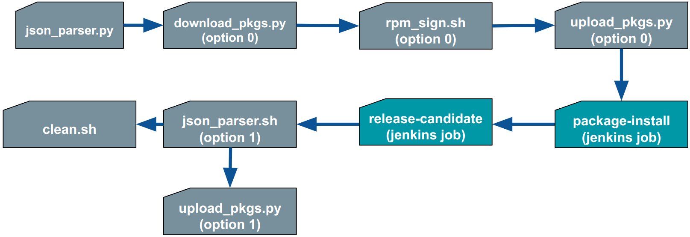
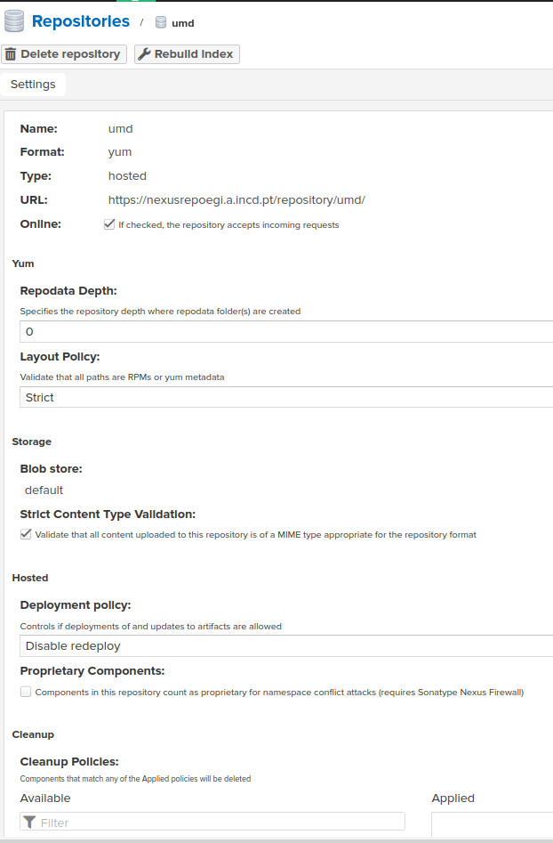

# Repositories for EGI UMD/CMD

EGI repository backend scripts and pipelines, for UMD/CMD releases.
The repository structure is the following:

* <https://nexusrepoegi.a.incd.pt/repository/umd/5/>
  * `<OPERATING_SYSTEM>/release/<ARCH>`
  * `<OPERATING_SYSTEM>/testing/<ARCH>`
  * `<OPERATING_SYSTEM>/contrib/<ARCH>`

For example for Alma Linux 9 x98_64, the complete paths are:

* <https://repository.egi.eu/repository/umd/5/al9/release/x86_64>
* <https://repository.egi.eu/repository/umd/5/al9/testing/x86_64>
* <https://repository.egi.eu/repository/umd/5/al9/contrib/x86_64>

The process is as follows:

| **#** | Script                            | Description              |
| -- | ------------------------------------ | ------------------------ |
| 00 | N.A.                                 | Creation of a Pull Request (PR), containing the details of the new product's release (within `json/` folder). |
| 01 | < Jenkins SCM plugin >               | git clone repository - get json |
| 02 | `json_parser.py`                     | Parse json, get the list of files to download and produce list of filenames (packages). |
| 03 | `download_pkgs.py` (option 0)        | Download the packages from original developer location, to a temporary directory. |
| 04 | `rpm_sign.sh` (option 0)             | RPM sign each package and verify signature. |
| 05 | `upload_pkgs.py` (option 0)          | Upload each package to nexusrepo - testing repository. |
| 06 | < Jenkins' `package-install` job >   | Validate package installations from testing repository and perform functional tests. |
| 07 | < Jenkins' `release-candidate` job > | Install all packages in release repo together with the new packages from testing |
| 08 | `json_parser.py` (option 1)          | Produce new json file as asset of the new release |
| 09 | N.A.                                 | Approve the PR |
| 10 | N.A.                                 | Run manually the following scripts |
| 11 | `upload_pkgs.py` (option 1)          | Upload packages to release repo |
| 12 | `cleanup.py`                         | Cleanup - remove packages from testing repo |
| 13 | N.A.                                 | Create the git release (and git tag) - add json file as asset of the release. |
| 14 | N.A.                                 | Get json file in the frontend for publication. |



## Pre condition

### On nexusrepo

The repository in nexusrepo should be created manually, if it does not exist, with
the following settings:



The repository is called `umd` and is of `Type = hosted`.

* Create repository
* yum(hosted)
* Name: umd
* Repodata Depth: 0

Other options left to default.

### On frontend and backend

Create a user that can run all scripts and upload json from the backend to the frontend. On the
backend:

```bash
sudo useradd repo_user
su - repo_user
ssh-keygen
```

On the frontend, we also create the same user but the home directory will be the location of the
json files:

```bash
sudo useradd -d /var/www/html/json_dir repo_user
chmod 755 json_dir/
su - repo_user
mkdir .ssh
chmod 700 .ssh
cd .ssh
vim authorized_keys

## Put id_rsa.pub ssh key created in the backend host
```

### Configuration options and Environment variables

The file `repo.conf` contains configuration options. These options can also be set by environment
variables:

| `repo.conf`    | `ENV_VARIABLE`     | Comment                                             |
| ---------------| ------------------ | --------------------------------------------------- |
| `repo_uri`     | `UMD_REPO_URI`     | Nexus repository URI                                |
| `repo_admin`   | `UMD_REPO_ADMIN`   | Nexus admin user able to upload packages            |
| `repo_pass`    | `UMD_REPO_PASS`    | Nexus admin password                                |
| `tmp_base_dir` | `UMD_TMP_BASE_DIR` | tmp directory to host the packages under validation |

## **02** Script: json_parser.py

The script `json-parser.py` implements item **02** from the pipeline:

If the json file is `~/software-releases/json/htcondor.json`, the script should be executed as follows:

```bash
cd scripts
python3 json_parser.py ~/software-releases/json/htcondor.json
```

1. Read json file with product information: `json/htcondor.json`
2. Create a dictionary with packages: URLs: variable `pkg_dict`
3. Write a list of packages to a file: `/tmp/umdcmd/htcondor.lst`

## **03** Script: download_pkgs.py (option 0)

The script `download_pkgs.py` implements item **03** (with option `0`) from the pipeline:

If the json file is `json/htcondor.json`, the script should be executed as follows:

```bash
cd scripts
python3 download_pkgs.py ~/software-releases/json/htcondor.json 0
```

1. Download packages to temporary directory: `/tmp/umdcmd/htcondor`, the option `0` means
the download is from the external source. Below the same script is run to download from the UMD/CMD
repository with option `1`.

## **04** Script: rpm_sign.sh (option 0)

The script `rpm_sign.sh` implements item **04** from the pipeline, if you pass option `0`,
it sign and verifies all packages. To list all rpm gpg keys:

```bash
rpm -q gpg-pubkey --qf '%{name}-%{version}-%{release} --> %{summary}\n'

gpg-pubkey-f4a80eb5-53a7ff4b --> gpg(CentOS-7 Key (CentOS 7 Official Signing Key) <security@centos.org>)
gpg-pubkey-d60a5e99-621398b3 --> gpg(RPM sign UMD/CMD <grid.admin@lip.pt>)
gpg-pubkey-352c64e5-52ae6884 --> gpg(Fedora EPEL (7) <epel@fedoraproject.org>)
```

The RPMs should be signed with gpg key:
`gpg-pubkey-d60a5e99-621398b3 --> gpg(RPM sign UMD/CMD <grid.admin@lip.pt>)`

Verify that you have the file in the home directory:

```bash
cat .rpmmacros

%_signature gpg
%_gpg_path /home/centos/.gnupg
%_gpg_name RPM sign UMD/CMD
%_gpgbin /bin/gpg
%__gpg_sign_cmd %{__gpg} gpg --batch --no-verbose --no-armor --pinentry-mode loopback --passphrase 'xxxyyy' --no-secmem-warning -u "%{_gpg_name}" -sbo %{__signature_filename} --digest-algo sha256 %{__plaintext_filename}
```

Execute this script as follows:

```bash
./rpm_sign.sh htcondor 0
```

## **05** Script: TO BE Implemented

Performs package installation

## **06** Script: upload_pkgs.py (option 0)

The script `upload_pkgs.py` implements item **06** from the pipeline, it uploads all packages to the
testing repository:

If the json file is `json/htcondor`, the script should be executed as follows:

```bash
cd scripts
python3 upload_pkgs.py  ~/software-releases/json/htcondor.json 0
```

## **07** Script: TO BE Implemented

Install packages from testing repo and perform functional tests

## **08** Script: TO BE Implemented

Install all packages in release repo together with the new packages from testing

## **09** Script: upload_pkgs.py (option 1)

The script `upload_pkgs.py` implements item **09** from the pipeline, it uploads all packages to the
release repository:

If the json file is `json/htcondor`, the script should be executed as follows:

```bash
cd scripts
python3 upload_pkgs.py htcondor 1
```

## **10** Script: json_parser.py (option 1)

Produce new json file as asset of the new release.

```bash
cd scripts
python3 json_parser.py htcondor 1
```

## **11** Script: cleanup.py

Cleanup - remove packages from testing repo.

```bash
cd scripts
python3 cleanup.py htcondor
```

## Full pipeline summary: Example

```bash
source ~/repo-env.sh
cd scripts
python3 json_parser.py htcondor
python3 download_pkgs.py htcondor 0
./rpm_sign.sh /tmp/umdcmd/htcondor 0

python3 upload_pkgs.py htcondor 0

python3 upload_pkgs.py htcondor 1
python3 json_parser.py htcondor 1
python3 cleanup.py htcondor
```
